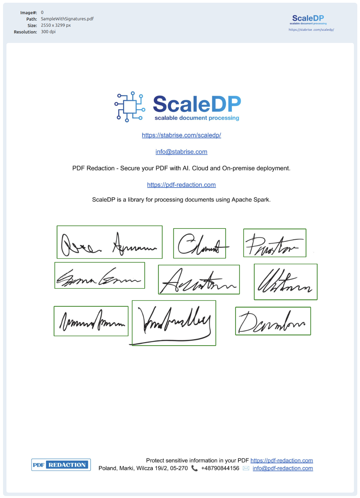

(SignatureDetector)=
# SignatureDetector

## Overview

`SignatureDetector` is a signature detection transformer based on the YOLO ONNX model. It efficiently detects signatures in images using a pre-trained model from Hugging Face Hub. The detector is implemented as a PySpark ML transformer and can be integrated into Spark pipelines for scalable signature detection tasks.

## Usage Example

```python
from scaledp import SignatureDetector, ImageDrawBoxes, PipelineModel

detector = SignatureDetector(
    keepInputData=True,
    partitionMap=True,
    numPartitions=0,
    scoreThreshold=0.25,
    task="detect",
    padding=20,
)

draw = ImageDrawBoxes(
    keepInputData=True,
    inputCols=["image", "signatures"],
    filled=False,
    color="blue",
    lineWidth=5,
    displayDataList=[],
)
# Transform the image dataframe through the signature detection stage
pipeline = PipelineModel(stages=[detector, draw])
result = pipeline.transform(image_df)
```



## Parameters

| Parameter         | Type    | Description                                      | Default                        |
|-------------------|---------|--------------------------------------------------|--------------------------------|
| inputCol          | str     | Input image column                               | "image"                       |
| outputCol         | str     | Output column for signatures                     | "signatures"                  |
| keepInputData     | bool    | Keep input data in output                        | False                          |
| scaleFactor       | float   | Image resize factor                              | 1.0                            |
| scoreThreshold    | float   | Minimum confidence score                         | 0.2                            |
| device            | Device  | Inference device (CPU/GPU)                       | Device.CPU                     |
| batchSize         | int     | Batch size for inference                         | 2                              |
| partitionMap      | bool    | Use partitioned mapping                          | False                          |
| numPartitions     | int     | Number of partitions                             | 0                              |
| pageCol           | str     | Page column                                      | "page"                        |
| pathCol           | str     | Path column                                      | "path"                        |
| propagateError    | bool    | Propagate errors                                 | False                          |
| task              | str     | Detection task type                              | "detect"                      |
| onlyRotated       | bool    | Return only rotated boxes                        | False                          |
| model             | str     | Model identifier                                 | "StabRise/signature_detection" |
| padding           | int     | Padding percent to expand detected boxes         | 0                              |

## Notes
- The detector uses the YOLO ONNX model from Hugging Face Hub for signature detection.
- Supports batch processing and distributed inference with Spark.
- Additional parameters can be set using the corresponding setter methods.

